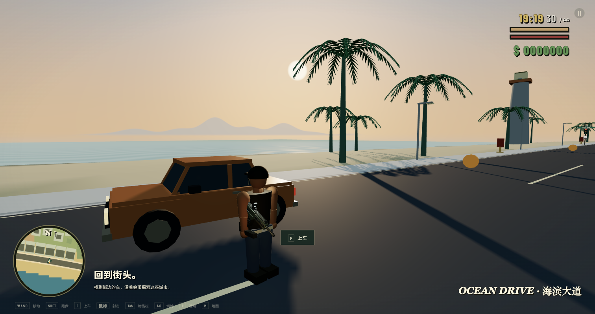
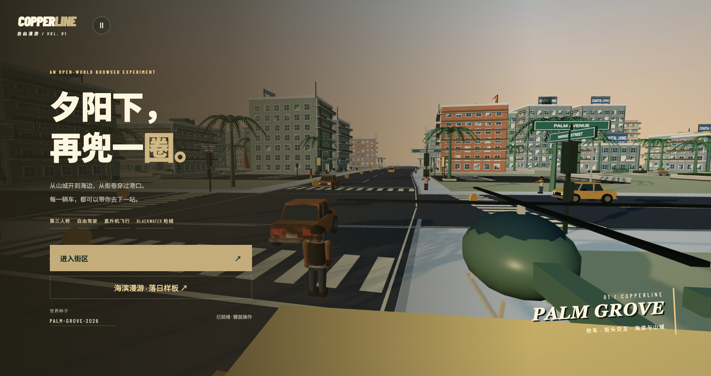

# Copperline

**夕阳下，再兜一圈。**

一个运行在浏览器里的单人城市沙盒。穿过街巷，找辆车开到海边，或驾驶直升机飞过港口。暖色夕阳、斑驳店招、棕榈树和低多边形街区，带着早期主机游戏的味道。

[在线试玩](https://copperline-rosy.vercel.app/) · [English](README.md) · [开发与验证](docs/DEVELOPMENT.md) · [代码架构](docs/ARCHITECTURE.md)



*使用 Ego Lite 截取本地开发版本。海滨画面为静态取景，隐藏了暂停遮罩；这是游戏实际渲染的 WebGL 场景，不是概念图。*

## 在这座城市里做什么

- **换一种方式兜风。** 开轿车或敞篷车，骑摩托车、自行车，也可以驾驶直升机飞过楼顶。接管街上的车辆，下车后还能找到同一辆车继续开。路边停车架上的装饰自行车是静态街景，不可骑乘。
- **走进街区。** 种子生成的住宅、商业、老城、中心、港口、河畔、山地与海滨由道路和桥梁连接。住宅、商铺和公寓大厅有开放入口，可以直接走进去。
- **自己找路。** 小地图随行，大地图支持平移、缩放和沿道路导航。既可以从街区起步，也可以在标题页直接选择「海滨漫游」。
- **捡金币，换装备。** 步行或驾车都能拾取金币，去武器商店购买步枪、手枪、冲锋枪、霰弹枪、狙击枪和轻机枪。每把枪独立保留弹药与换弹进度。
- **与街头互动。** 枪声、攻击和抢车会引发 NPC 反应，敌对行人会还击，被击败后掉落金币。支持第一／第三人称切换、肩后瞄准与狙击镜。
- **键鼠或触屏游玩。** 桌面端用鼠标控制视角；手机端提供摇杆、视角滑动、按住开火、开镜，以及随场景变化的载具和商店按钮。



*Ego Lite 实际标题页截图，使用默认种子 `PALM-GROVE-2026`。当前游戏界面为中文。*

## 本地运行

需要 **Node.js 22.13+**、npm 和支持 **WebGL 2** 的现代浏览器。桌面端推荐 Chrome 或 Edge。无需后端、账号或 API Key。

```sh
git clone https://github.com/wengxiaoxiong/copperline.git
cd copperline
npm ci
npm run dev
```

打开 Vite 输出的地址，通常是 `http://localhost:5173/`。

1. 保留默认世界种子，或在开始前输入自己的种子。
2. 选择「进入街区」或「海滨漫游」。
3. 桌面端允许浏览器锁定鼠标后开始；失败时点击重试，或直接用 Chrome／Edge 打开页面。按 **Esc** 释放鼠标并暂停。

手机建议横屏游玩。本地调试时，让手机和电脑连接同一网络，打开 Vite 输出的 Network 地址。触屏控制不需要鼠标锁定。

## 操作方式

| 操作 | 桌面按键 |
| --- | --- |
| 步行／驾驶／直升机前后移动与转向 | **W A S D** |
| 步行时跑步 | **Shift** |
| 跳跃／载具手刹／直升机上升 | **空格** |
| 直升机下降 | **Shift** |
| 上下附近载具／抢车 | **F**；上车前需低速，下车前先停稳 |
| 射击／瞄准或狙击镜 | **鼠标左键／右键** |
| 换弹 | **R** |
| 切换已拥有的武器 | **1–6** |
| 物品栏 | **Tab** 或 **I** |
| 靠近武器商店时打开商店 | **E** |
| 第一／第三人称视角 | **C** |
| 城市大地图 | **M**；拖动平移、滚轮缩放、点击道路设置导航 |
| 返回附近道路 | **V** |
| 静音／恢复声音 | **N** |
| 暂停／释放鼠标 | **Esc** |

手机端使用**左侧摇杆**移动，在**右侧空白区域**滑动转动视角。按住「开火」瞄准并射击；装备狙击枪时，「开镜」切换狙击镜。靠近载具或武器商店会出现情境按钮，辅助按钮按当前状态切换为跳跃／换弹、手刹或直升机上升／下降。

打开地图、物品栏或暂停界面都会停止玩法推进。桌面端返回游戏时需要重新锁定鼠标。

## 技术实现

**TypeScript · Three.js · Rapier WASM · Vite · 原生 HTML/CSS**

城市、人物与载具主要由程序化几何生成。地形、道路、车流和地图共享同一个 `WorldPlan`。场景按 **72 米**区块加载，保留附近 **7 × 7** 个区块，并通过原点平移让渲染与物理坐标保持在玩家附近。物理以固定 60 Hz 推进；相同种子可以重建相同布局，但整局游戏模拟并非确定性的。

npm 包仍保留历史名称 `react-gta`，当前应用**没有使用 React**。

| 模块 | 源码入口 |
| --- | --- |
| 启动与游戏会话编排 | [`main.ts`](src/main.ts)、[`game.ts`](src/game.ts) |
| 世界规划与地块用途 | [`generation.ts`](src/generation.ts)、[`parcels.ts`](src/parcels.ts) |
| 地形、建筑与区块加载 | [`world.ts`](src/world.ts)、[`landscape.ts`](src/landscape.ts)、[`interiors.ts`](src/interiors.ts) |
| NPC、车辆控制权与驾驶 | [`population.ts`](src/population.ts)、[`vehicle-dynamics.ts`](src/vehicle-dynamics.ts) |
| 武器、物品栏与命中计算 | [`inventory.ts`](src/inventory.ts)、[`combat.ts`](src/combat.ts)、[`targeting.ts`](src/targeting.ts) |
| 相机、地图、触屏与界面 | [`camera-rig.ts`](src/camera-rig.ts)、[`atlas.ts`](src/atlas.ts)、[`mobile-controls.ts`](src/mobile-controls.ts)、[`hud.ts`](src/hud.ts)、[`equipment-panel.ts`](src/equipment-panel.ts) |

模块职责、坐标约定与资源生命周期见[架构文档](docs/ARCHITECTURE.md)，参与开发前请阅读 [AGENTS.md](AGENTS.md)。

## 构建与验证

```sh
npm test          # Node test runner + tsx
npm run build    # strict TypeScript 检查，再执行 Vite 构建
npm run preview  # 本地预览生产构建
```

构建结果在 `dist/`，可部署到静态托管。回归测试覆盖世界生成、道路碰撞、建筑进出、车辆物理与接管、战斗、物品栏、相机及输入状态切换。当前构建仍有 JavaScript 包体积提示，包内包含 Rapier WASM。

浏览器场景脚本和仅开发环境可用的 `window.__game` 入口见[开发与验证说明](docs/DEVELOPMENT.md)。场景脚本可能重置或移动当前会话。自动化测试和静态截图不代表完整键鼠游玩、手机真机体验或持续帧率验收。

## 当前边界

- **单人、单次会话。** 没有多人联机或跨刷新存档。部分状态在区块卸载后仍会保留，但刷新或重新开始会清空进度；死亡复活保留金币与已购武器。
- **城市有边界。** 路网约两公里宽，外围地面可以继续加载，道路不会无限延伸。海上的远岛剪影是背景，不能抵达。
- **模拟仍是原型。** 驾驶与人物动作经过简化；没有警察追捕、剧情战役、游泳或载具内射击。进入深水会恢复到道路。仓库尚未开放，市场、球场和信号灯属于街景，未接入完整玩法。
- **性能取决于设备。** 区块加载限制附近几何量，但已接管车辆和改变过的 NPC 记录仍可能随会话累积。屏幕时钟是装饰，没有昼夜循环。

## 署名与许可

部分枪械几何、特效和音效改编自 [BLACKWATER — Silent Harbor](https://github.com/Hiraeth010/blackwater)，保留其 [MIT 许可证](src/vendor/blackwater/LICENSE)。改编范围见 [THIRD_PARTY_NOTICES.md](THIRD_PARTY_NOTICES.md)。Three.js 使用 MIT 许可，Rapier 使用 Apache-2.0 许可，其他依赖遵循各自许可。

Copperline 是独立原型，与 Rockstar Games 或 Take-Two Interactive 无关联；仓库未包含提取的 GTA 素材或原版游戏截图。**项目原创代码尚未选择统一许可证**，仓库公开不等于自动授予复用权。详细说明见[法律与署名文档](docs/LEGAL.md)。
