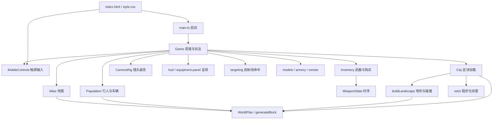

# Copperline 代码架构

本文按 2026-09-11 的工作区源码整理，包含物品栏、武器商店和直升机实现；它们不代表已发布版本。文档描述当前实现，末尾的演进建议尚未实施。

## 整体结构

这是一个运行在浏览器主线程中的 TypeScript 游戏，使用 Vite 构建、Three.js 渲染、Rapier WASM 处理物理。界面是 HTML/CSS 与直接 DOM 操作；虽然包名是 `react-gta`，当前没有 React，也没有后端、数据库或多人同步服务。

整体采用 `Game` 集中调度、功能模块提供能力的结构，并非 ECS 或独立服务架构。世界生成规则与呈现已有明确分离，玩法编排仍集中在 Game；HUD 和装备面板通过独立呈现模块更新。

图中箭头表示主要调用或数据依赖，省略各模块对 Three.js 和 Rapier 的直接依赖。

## 模块与职责

| 文件 | 当前职责 | 主要边界 |
| --- | --- | --- |
| [main.ts](../src/main.ts) | 等待 Rapier 初始化、创建 Game、启动失败提示 | 仅开发模式暴露 `window.__game` |
| [game.ts](../src/game.ts) | 场景与物理世界、输入、模式切换、步行/驾驶/飞行、射击结果、拾取、界面数据和音效编排 | 拥有整个会话，协调其他模块 |
| [generation.ts](../src/generation.ts) | 种子随机、地理高度、区域、道路图、道路采样、导航、建筑与金币布局 | 不依赖 DOM、Three.js 或 Rapier |
| [world.ts](../src/world.ts) | `City`：创建/卸载区块、静态建筑、金币与靶标、世界偏移 | 持有加载资源以及已拾取/已击倒集合 |
| [landscape.ts](../src/landscape.ts) | 地形、水面、道路、桥梁和地标的模型及碰撞 | 读取同一 WorldPlan，向区块登记刚体 |
| [population.ts](../src/population.ts) | 行人和车流生成、行为、伤害、掉落、车辆接管、实例化呈现 | 拥有角色身份和车辆控制权，通过回调伤害玩家 |
| [inventory.ts](../src/inventory.ts) | 武器参数、拥有关系、购买与装备 | 每把已拥有武器持有独立 WeaponState；钱包由 Game 持有 |
| [hud.ts](../src/hud.ts) / [equipment-panel.ts](../src/equipment-panel.ts) | HUD 与装备列表呈现 | 接收所需数据与 DOM，不接收 Game，不修改玩法状态 |
| [targeting.ts](../src/targeting.ts) | 相机瞄准、散布与枪口遮挡 | 返回命中结果；调用方先更新场景矩阵，模块不扣血或播放特效 |
| [combat.ts](../src/combat.ts) | 弹匣、射击冷却、换弹、后坐力状态 | 不负责命中判定，也不依赖渲染或 DOM |
| [camera-rig.ts](../src/camera-rig.ts) | 第一/第三人称姿态、支臂、瞄准过渡、后坐力偏移 | 场景避障与最终相机应用在 Game 中 |
| [mobile-controls.ts](../src/mobile-controls.ts) | 摇杆手势、右侧视角拖动、按钮按压状态与情境文案 | 只拥有触摸输入；不决定上车、射击或载具规则 |
| [atlas.ts](../src/atlas.ts) | Canvas 2D 大小地图、平移缩放、导航、探索记录 | 通过状态回调获取世界坐标；关闭交给 Game |
| [models.ts](../src/models.ts)、[armory.ts](../src/armory.ts)、[retro.ts](../src/retro.ts) | 程序化人物、汽车、直升机、武器商店、额外武器、纹理与植物 | 提供可视对象，玩法状态由调用方维护 |
| [vendor/blackwater](../src/vendor/blackwater/) | 上游改编枪械呈现和音效 | 保留原许可证，见 THIRD_PARTY_NOTICES |

## 启动、模式与主循环

`index.html` 提供画布、菜单、HUD、地图和装备面板。`main.ts` 先禁用开始按钮，等待 `RAPIER.init()`，再构造 `Game`。构造过程创建渲染器、物理世界、城市、玩家、车辆、地图和事件监听器，随后进入动画循环。初始化失败会显示错误面板。

`Game.mode` 有 `menu`、`playing`、`paused`、`map`、`equipment` 五种值。驾驶和飞行另由 `driving`、`flying` 表示，上车过程由 `entry` 表示，它们不是独立的顶层模式。键盘和触屏输入最终合并到同一组步行、驾驶、飞行和战斗状态，不复制玩法。

桌面端开始或恢复时，`start()` 请求 Pointer Lock；只有实际获得鼠标锁定才进入 `beginPlaying()`。触屏设备直接进入游戏，由 `MobileControls` 提供摇杆、视角和按压状态。打开地图、装备面板或暂停时，两种输入都会被清空，避免恢复后继续移动或射击。失焦和页面隐藏也会触发暂停。

`animate()` 每帧执行，玩法帧时间限制为最多 0.05 秒：

1. 在 `playing` 下更新城市加载范围，用累加器以 **1/60 秒固定步长**调用 `step()`。
2. `step()` 推进所有已拥有武器的时序、上车过程和当前移动方式，更新 Population，然后执行 Rapier 步进；之后处理落水恢复、移动距离、扫掠拾取和原点平移。
3. 同步模型、地图导航和人物/武器动画，更新相机，然后按射击输入调用 `fire()`，最后推进特效和声音。
4. 渲染场景，约每 0.1 秒刷新 HUD 和小地图。暂停仍渲染场景；菜单还有独立镜头动画。

注意：物理与武器冷却使用固定步长，但射击触发位于渲染帧中，不能把整套玩法视为固定步长的确定性模拟。种子只保证生成规则可复现；实时输入、时间和射击散布等仍影响运行结果。

## 世界数据、区块和坐标

`WorldPlan` 是地理和道路规则的共同来源。它先按种子构造有限道路图，提供 `heightAt()`、`surfaceAt()`、`sampleRoad()`、`route()` 等查询。`generateBlock()` 再按区块生成建筑和可拾取物。`worldPlan(seed)` 只缓存最近一个种子的规划，不是多世界注册表。

区块边长 `BLOCK = 72`，用于资源加载；道路并不按区块边界独立生成。City 通常保留玩家周围 **7 × 7** 个区块。地形和桥面的网格碰撞由 Landscape 构造，道路分段按中点归属区块。地图、车流、道路呈现共享规划数据，修改路网时应同时验证这些消费者。

系统存在三种坐标：

| 坐标 | 用途 | 转换 |
| --- | --- | --- |
| 世界逻辑坐标 | 地形查询、区块编号、地图、商店距离 | `logical = local + city.offset` |
| 场景/物理局部坐标 | Three.js 对象、Rapier 刚体、相机与射线 | `local = logical - city.offset` |
| 区块内坐标 | 区块 root 下的地形与建筑几何 | root 位于区块世界原点减 offset |

`chunkAt()` 使用 `Math.floor`，负坐标也必须沿用这个规则。活动对象局部 x 或 z 超过 1500 时，`shiftOrigin()` 按整区块平移 City、Population、玩家、直升机、相机和特效，并重新定位商店。新增世界对象时必须同时处理原点平移，否则地图和碰撞会与可视位置分离。

城市路网约 1.5 公里宽且有边界；区块地面可继续生成，不意味着道路无限延伸。

## 角色、战斗和物品栏

Population 管理 NPC 与车辆的运行时对象、实例化网格和命中身份映射。普通车流沿 WorldPlan 道路移动，车辆接管通过 `beginEntry()`、`takeControl()`、`leave()` 转移控制权，保留同一车辆身份与刚体。已接管车辆与普通车流的卸载策略不同。

`Game.fire()` 通过 WeaponState 检查冷却、弹药等条件，再调用 `traceShot()` 从相机射线确定瞄准点，从枪口发射第二条射线决定实际命中。`traceShot()` 可注入随机数函数以验证散布行为，并返回 hit、muzzle、impact，伤害及特效仍由 Game 编排。遮挡候选包括城市、靶标和 Population 对象。命中 NPC 交给 Population，靶标击倒记录交给 City；射击不是 Rapier 子弹刚体模拟。

Inventory 保存拥有的武器与当前槽位。`buy(slot, coins)` 返回购买结果和新余额，由 Game 应用到钱包；购买成功立即装备，重复购买不扣款。切枪保留各自弹药及换弹状态，固定步进会更新所有已拥有武器，因此后台武器也会完成换弹。商店和物品栏 DOM 由 equipment-panel 渲染，购买事件及余额更新由 Game 处理，商店模型在 armory 中创建。

## 状态生命周期与资源

当前没有跨刷新存档。生成数据可以按种子重建，玩家改变的数据保留在本次 Game 会话中：

| 状态 | 所有者 | 生命周期 |
| --- | --- | --- |
| 区块网格、静态碰撞 | City | 离开加载范围后卸载，回访重建 |
| 已拾取金币、已击倒靶标 ID | City | 跨区块卸载保留，reset 清空；不保存靶标所有中间伤害 |
| 改变过的行人 | Population.changedPeople | 在会话内保留身份和状态，reset 清空 |
| 普通车流 | Population | 距离卸载后移除刚体，可重新生成 |
| 已接管车辆 | Population | 保留，不按普通车流距离卸载 |
| NPC 掉落金币 | Population.drops | 仅附近保留，远离后删除，并非永久存档 |
| 金币余额、生命、物品栏 | Game | reset 或刷新后重置 |
| 路线、探索记录 | Atlas | 内存状态，reset 重置路线与探索记录 |

City 卸载会移除区块刚体并回收区块独占几何/材质，共享资源有单独的保留判断。特效在过期时释放几何和材质。Population 使用实例化呈现减少绘制调用，但已改变角色和接管车辆仍会累积，不能由“49 个区块”推导总内存恒定。

## 当前架构评价与演进方向

现有结构适合快速迭代单人原型：生成规则可脱离浏览器测试，City 与 Population 分别拥有静态和动态对象，WorldPlan 让地图、道路和车流使用相同数据。

主要压力在 `Game`：它仍拥有输入、模式切换 DOM、移动、战斗结果和会话状态，新增模式需要修改多个条件分支。测试也经常用 `Object.create(Game.prototype)` 配合替身绕开完整构造，这降低了测试启动成本，但暴露了初始化与玩法耦合。

后续可按实际需求渐进调整：

1. HUD 和装备呈现、双射线计算已拆出；后续可继续分离输入/模式切换，保留 Game 作为会话调度入口。
2. 为步行、汽车和直升机明确进入、退出、更新契约，减少布尔状态组合。
3. 新增可流式对象时明确创建、卸载、原点平移、reset 的责任；若要反复创建 Game，还需补完整事件监听与渲染/音频资源销毁流程。
4. 做存档时单独定义逻辑 ID 和可序列化状态，不直接序列化 Three.js 或 Rapier 对象。

以上未完成部分是演进建议。当前重构仅分离 HUD、装备呈现和命中计算，没有重写移动、世界生成或输入模式。
